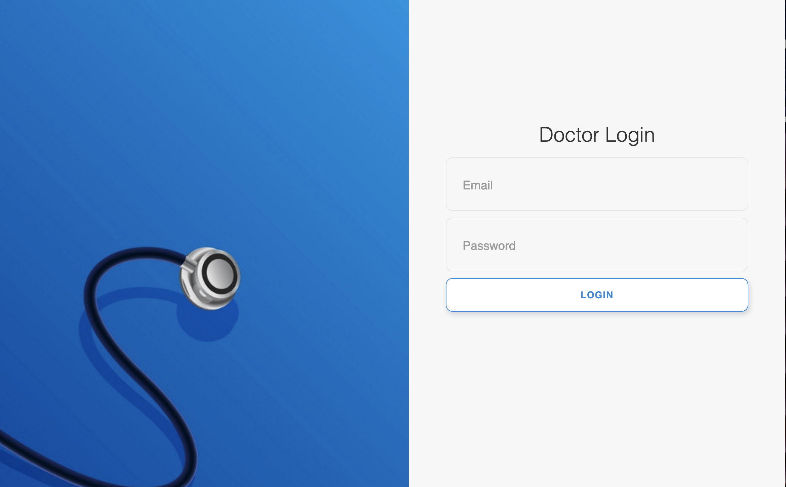
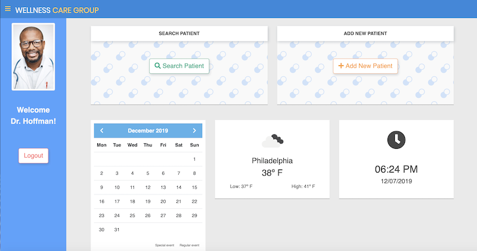
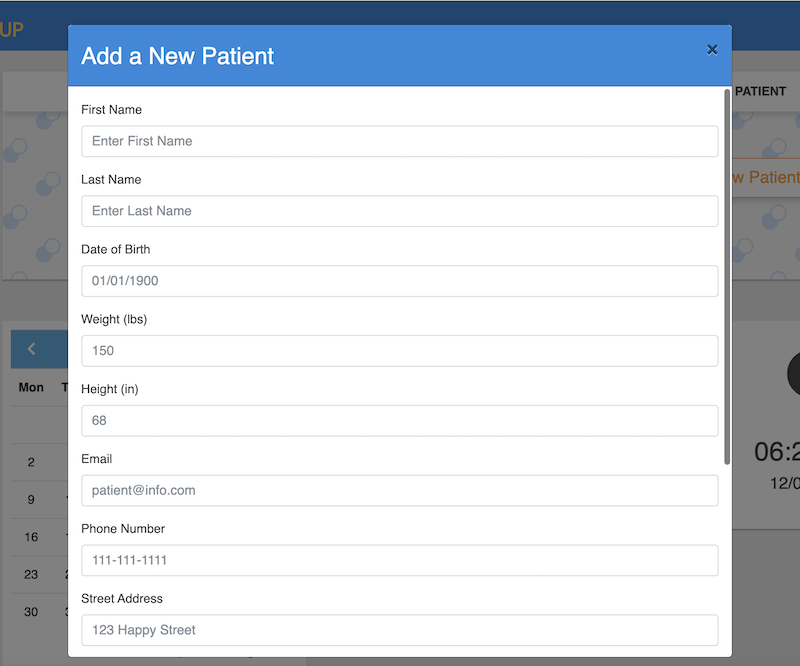
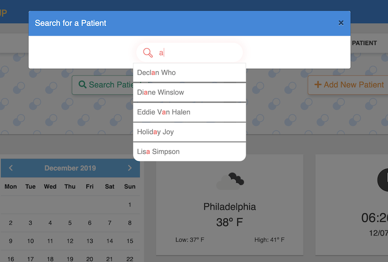
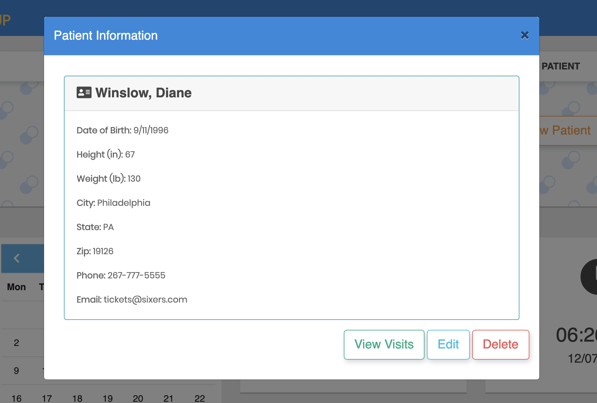
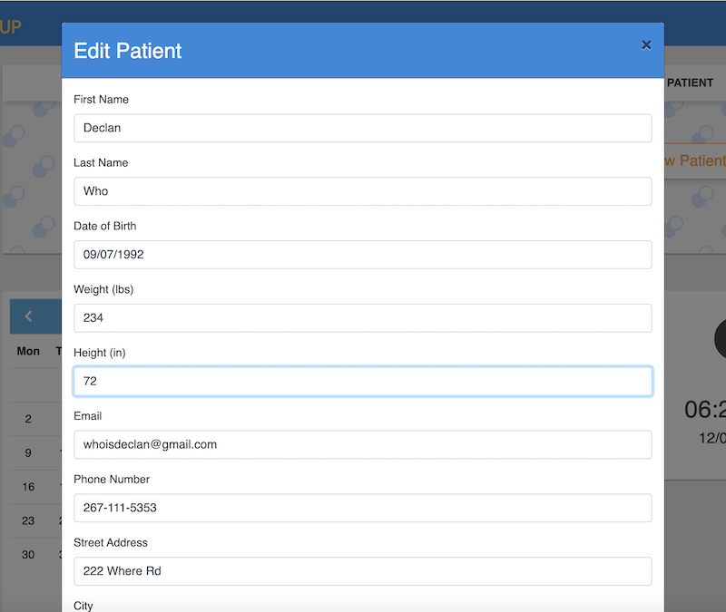
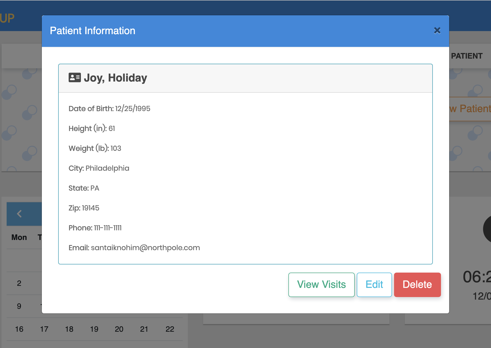
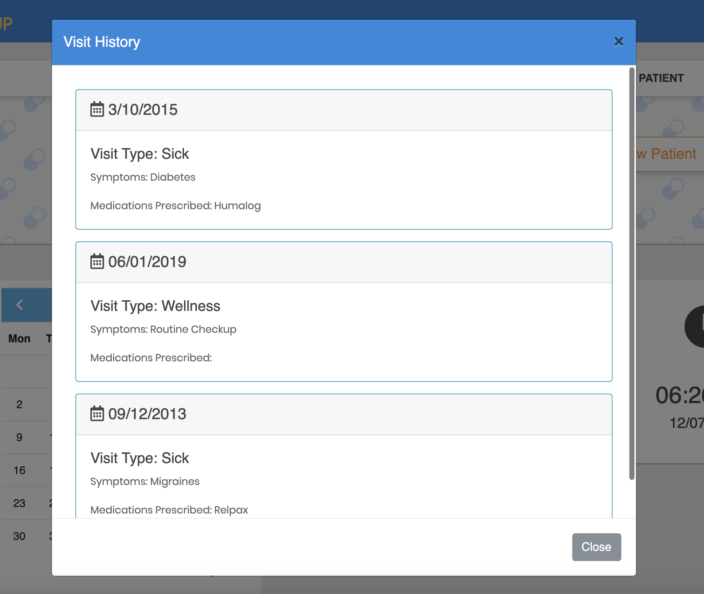

# Doctor Portal

## Overview

Doctor Portal is a full stack application that has a concise and well-structured dashboard. The UI provides doctors with an easy, clear way to create/read/update/delete (CRUD) patient information. The dashboard also integrates basic and common information such as a calendar, clock and local weather.
 
> Deployed Link: [See Here](https://doc-portal.herokuapp.com/)

> Repository: [See Here](https://github.com/purpetrator/Project2)

## How to Use

#### Demo accounts:
> Dr. Kristen Jones
> Username: jones@gmail.com
> Password: 1111

> Dr. Mark Hoffman
> Username: hoffman@gmail.com
> Password: 2222

> Dr. Harris Gratz
> Username: gratz@gmail.com
> Password: 3333

### Login
Doctors can login with their Username and Password. Doctors are only able to view their own patients and don't have access to other doctors' patients.

### Add Patient
Doctors can add new patients by clicking the "Add New Patient" button and entering patient information.

### Search Patient
Doctors can search patients by clicking the "Search Patient" button and entering either the first or last name.

### View patient
Doctors can view patient information by selecting a patient's name from the search bar results.

### Edit Patient
Doctors can update patients by clicking the "Edit Patient" button and updating patient information.

### Delete Patient
Doctors can delete patients by clicking the "Delete" button.

### View Visits Patient
Doctors can view patients visits history by clicking the "View Visits" button.

## Technologies Used

- Node.js
- MySQL
- JavaScript
- Sequelize
- Express
- Handlebars.js
- Passport.js
- Autocomplete.js

### Node Packages used:

- MySql
- DotEnv
- express-hbs

## Authors:

- Ana Chernov - https://github.com/purpetrator
- Valentyna Abraimova - https://abraval.github.io/MainPortfolio
- Bailing Zhang - https://easonchang15530.github.io/Bootstrap-Portfolio
- Liam Wynne
